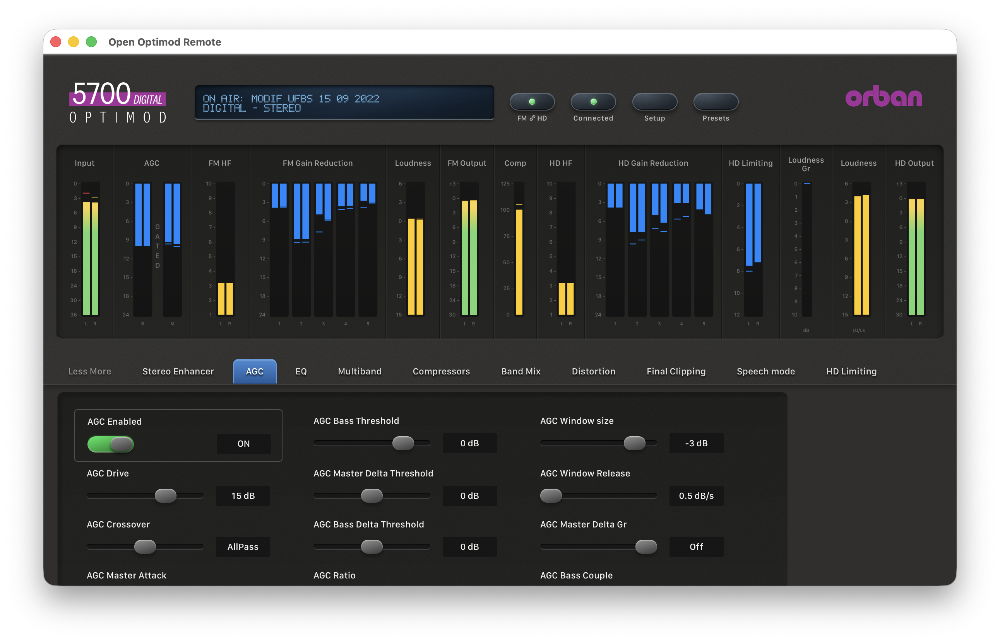
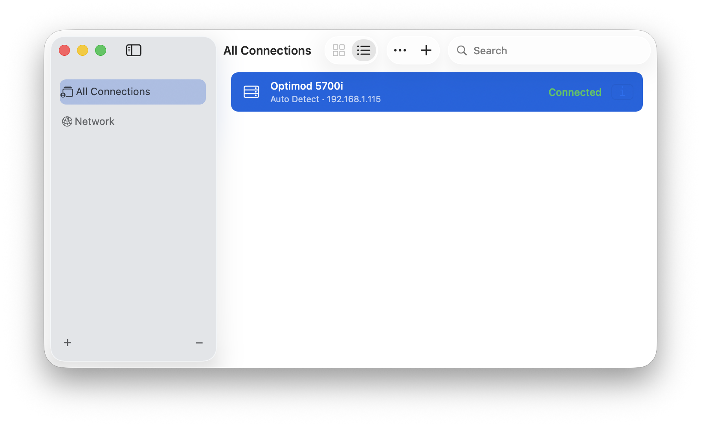

# Open Optimod Remote

Independent open-source control software for Orban OPTIMOD processors, starting with the **OPTIMOD 5500, 5700i and 8700HD**. More models will follow.

| Model | Firmware | Control | Verified on hardware |
|---|---|---|---|
| OPTIMOD 5500 | 1.2.8.24 | Full: settings, presets, live meters | Not yet; derived from Orban's PC Remote and firmware |
| OPTIMOD 5700i | 3.0.1.20 | Full: settings, presets, live meters | Yes |
| OPTIMOD-FM 8700HD | 1.0.2.161 | Full: settings, presets, live meters, FM and HD | Not yet; derived from Orban's PC Remote and firmware |
| 5500i, 5700 FM/HD, 6300, 8500, 8600, 8700i, 9300, 9400 | any | Read-only | — |

A native Rust process communicates directly with the processor and the installed macOS app presents the interface in its own native window. No Windows, browser, Wine, CrossOver or Orban runtime is required for normal use.



**[Download for macOS](https://github.com/marktunzi/open-optimod-remote/releases/latest)**: signed and notarized, Apple Silicon, macOS 13 or later.

## Why this exists

OPTIMOD processors sit at the end of the air chain in radio stations around the world and stay in service for many years. The software to control them from a computer, Orban's PC Remote, runs only on Windows. An engineer on a Mac has to keep a Windows PC around, run a virtual machine, or put Wine or CrossOver between themselves and an on-air processor, just to adjust a setting or watch the meters.

Open Optimod Remote removes that detour. It is a native Mac app that talks to the processor directly over its own network protocol. There is no Windows, no emulation layer and no Orban executable.

Because it controls equipment that is on air, it is deliberately strict:

- it only shows values the processor has confirmed;
- meters are never simulated;
- a failed write is never replayed automatically;
- models without their own parameter profile stay read-only;
- models whose profile is derived from the official software instead of hardware (currently the 5500 and 8700HD) say so on screen, and every write is confirmed by reading the processor back.

It is open source because that knowledge should not live in one person's head or on one workstation. The 5500, 5700i and 8700HD are the starting point: every further OPTIMOD model is meant to be added the same way. The protocol, the parameter mappings and the verification notes are documented in this repository. A model can be unlocked from its official PC Remote installer ([adding a model](docs/adding-a-model.md)), but only someone with that exact processor can confirm it on hardware. If you run a 5500, an 8700HD or one of the read-only models, your verification is the most valuable contribution you can make. See [Contributing](#contributing).

**Development build, not a complete Windows PC Remote replacement.** The target remains full feature and interaction parity, including FM/HD, live metering, presets, setup and maintenance. See [compatibility](docs/compatibility.md) and [verified protocol](docs/protocol/5700i.md).

Research for adding the 8200, 8400 and later OPTIMOD families is documented in [multi-model support](docs/research/2026-09-22-multi-model-optimod-support.md), with an executable [adapter plan](docs/plans/2026-09-22-multi-model-adapter-plan.md). The running app detects and reads processing/setup documents and preset catalogs from 5500i, 5500, 5700 FM, 5700 HD, 6300, 8500, 8600, 8700i, 9300 and 9400 through separate read-only adapters.

The **OPTIMOD 5500** (firmware 1.2.8.24) and the original **OPTIMOD-FM 8700HD** (firmware 1.0.2.161) are fully controllable: parameter writes, preset recall, live meters and their own processing pages. Their profiles were derived from the official PC Remote and firmware in Orban's installers and cross-checked against the factory presets. They have **not yet been verified on hardware**, so the app labels them as statically derived and reads every change back from the processor. See the [static analysis](docs/research/2026-09-29-5500-8700hd-static-analysis.md).

## Current implementation

- Authenticated direct PC Remote connection, bounded framing, archive decoding and fresh state verification.
- A model-aware adapter registry: the hardware-verified 5700i, the statically derived writable 5500 (1.2.8.24) and 8700HD (1.0.2.161), and read-only adapters for the 5500i, other 5500 firmware, 5700 FM, 5700 HD, 6300, 8500, 8600, 8700i, other 8700HD firmware, 9300 and 9400. Only an exact login banner with an embedded profile can write. Each profile carries its own parameters, processing pages and meter layout, generated by `scripts/extract_pc_remote.py`. Saved connections support Auto Detect or an explicit model, reject a mismatching device banner, and migrate existing connection files to schema version 2 automatically.
- A separate visual skin for every currently selectable processor, including its own local product mark, material colors, LCD treatment, path label and meter grouping. Unknown identity uses a neutral skin instead of borrowing the 5700i interface.
- 222 processing fields and 178 system fields read on the reference device. All 400 have editors: 366 reference mappings plus 34 typed text fields. A matching current value is required before indexed writes.
- Dark English instrument interface built from the final supplied 2264×2108 artwork, with an asset-backed 5700 header, one global coupling/status area and 16 grouped processing pages. Fine chassis texture stays off the clean meter canvas; the rounded meter group uses the reference light inner outline and soft white lower highlight. FM and HD meter groups remain visible together; the FM/HD processing selector appears only while the paths are decoupled.
- An explicit FM → HD processing-coupling control with a confirmation step in the global bar. It is the only global setting; physical output routing remains separate.
- A compact native Presets browser with a source-list sidebar, search, Factory/User/Modified filters, title-cased names and a trailing on-air state. The written Recall button is the explicit action and starts immediately without a second confirmation sheet; row selection and double-click do not change the processor. Import/export live in a compact toolbar action menu. Recall validates against the already loaded catalog and current document, then performs one combined RP/AP terminal transaction while PC Remote polling is paused; it re-enables meters once and resumes the normal cadence 50 ms later. The window can export the current processing document to a local `.orb57user` file and apply a compatible local file through individually validated writes plus a complete final document comparison. The first confirmed processing document is the session baseline; Recall or a successfully applied file replaces it with the new preset baseline. Edited values stay cyan until restored to that baseline. Recall and file application are covered by synthetic tests, not yet an on-air hardware test.
- Separate physical routing controls for analog L/R, Digital 1, Digital 2 and headphones. Viewing FM/HD never changes routing.
- A compact Finder-style native macOS Connections browser for adding, editing, searching, connecting, switching and removing multiple named processors. It uses an `NSSplitViewController` with a real `.sidebar` split item, a 200–260 point system-resizable sidebar, unified toolbar, 52-point rows, native active/inactive selection colors and no duplicate bottom inspector. Its Network source scans the active local IPv4 subnet and recognizes TCP 23 banners for all eleven selectable PC Remote models without sending a credential. Addresses, model choices, ports and access codes are stored locally in Application Support; codes are displayed only as bullets and do not use Keychain.
- Task-oriented Setup with ten categories, named subsections, plain-English labels, current values, read-only status handling and cross-category search. Physical source assignment links to Outputs.
- A separate native **Optimod 5700i Settings** window opens from **System Settings…** or Command-,. Ten icon-backed primary tabs expose 134 System/I/O controls with native switches, segmented controls, compact fixed-width range sliders and text/IP/port fields, pickers and 24 individual RDS AF selectors. Input, Test, Network, Stereo Encoder and HD/Digital Radio show their complete grouped page at once; larger categories use a second native section selector. Every profile-backed control is checked against the firmware 3.0.1.20 mapping during tests. The window follows the current macOS Light/Dark appearance.
- Processing sliders follow the supplied SVG dimensions and materials: 151×8 px tracks, 28×18 px textured metal thumbs and 70×26 px value fields, including the specified inner and drop shadows.
- Processing edits move immediately in the interface while the single-owner service checks the active host/session/preset and cached current field, sends one ordered device write, and crosses the PC Remote 250/251 response boundary. Successful interactive writes update that guarded cache without requesting a full terminal document: the reference 5700i pauses meter delivery for roughly 570 ms while producing each AP/AS snapshot. A boundary failure falls back to exact terminal readback, while manual refresh, export and preset workflows still use full documents. Polling cannot snap an in-flight control back to its old value, and a failed write is never replayed automatically.
- Per-channel meter display curves, fixed 8 px lanes, reference-sized stereo/mono wells, independent 900 ms peak hold, a 50 ms polling target and velocity-continuous canvas interpolation at the browser refresh rate. Live measurement averaged approximately 55 ms per update in a short reference-device check.
- Pending/error states, access-level enforcement, host/session/preset stale-value checks, no automatic write replay, and loopback-only HTTP with Origin and Host validation.
- Routine successful writes do not create banners or log entries. Real failures are kept in the native **Error Log** window; private local IPv4 addresses are redacted from that log.
- A self-contained macOS app that starts its bundled control service, opens the interface in a native window and disconnects and stops its owned service when the app quits.
- A supplied high-resolution app icon is compiled into the `.icns` resource used by Finder, the Dock and the application switcher.

Hardware verification now includes display contrast with full restoration plus an actual B2 Output Mix change of 0.1 dB and exact restoration while connection state and live meters were monitored. Routing, text and Recall controls have not been exhaustively tested on hardware. HD editing is restricted while HD follows FM. Unsupported firmware is rejected.

Remaining work includes device gate/overload/lock indicators, some absolute meter axes, external-control events, on-device named preset Save/Save As/rename/delete/backup workflows, additional processing structures, scheduler, maintenance, optional hardware and long-duration validation. This is not yet full Windows parity.

## Install and run on macOS

Download the latest `OpenOptimodRemote-<version>-arm64.dmg` from [Releases](https://github.com/marktunzi/open-optimod-remote/releases/latest), open it and drag **Open Optimod Remote** to **Applications**. The release is signed with a Developer ID and notarized by Apple, so it opens without Gatekeeper warnings. It requires an Apple Silicon Mac with macOS 13 or later. The app starts the local service itself and loads the complete interface in its own window. Allow local-network access when macOS asks so it can reach the processor.

### Build from source

Prerequisites are Rust 1.85 or later, Node.js 22.12 or later, npm and the Apple Command Line Tools. To build, install into `/Applications` and verify the code signature and property list in one command:

```sh
DEVELOPER_DIR=/Library/Developer/CommandLineTools ./scripts/install-macos.sh
```

To build without installing:

```sh
./scripts/build-macos.sh
```

The generated bundle is `dist/Open Optimod Remote.app`, ad-hoc signed for local use.

### Signed and notarized release

```sh
CODESIGN_IDENTITY="Developer ID Application: Your Name (TEAMID)" \
ASC_KEY_ID=... ASC_ISSUER_ID=... \
./scripts/release-macos.sh
```

This signs every binary with the hardened runtime and a secure timestamp, notarizes and staples the app, then packages, signs, notarizes and staples `dist/OpenOptimodRemote-<version>-<arch>.dmg`, and finally checks both with `spctl`. The App Store Connect API key is read from `~/.appstoreconnect/private_keys/AuthKey_<ASC_KEY_ID>.p8` unless `ASC_KEY_PATH` is set.



The native Connections window opens on launch. Add a processor once with its name, address, ports and access code. Metadata is saved in `connections.json`; access codes are kept separately in `credentials.json`, both under `~/Library/Application Support/OpenOptimodRemote/`. The credentials file is restricted to the current macOS user and the UI renders saved codes as bullets. No Keychain access is used. PC Remote uses port 6201 and status verification uses port 23 by default. The internal HTTP service binds exclusively to loopback.

For web-development work, run `cargo run --release -p orban-web` from the repository root and open **http://127.0.0.1:5701**. The installed app does not require a separate browser.

## Validation

```sh
python3 scripts/check-docs.py
cargo test --workspace
cargo clippy --workspace --all-targets -- -D warnings
cargo fmt --all -- --check
node --experimental-strip-types --test packages/ui/tests/*.test.ts
npm run build --prefix packages/ui
swiftc -parse-as-library native/macos/LauncherCore.swift native/macos/LauncherCoreTests.swift -o /tmp/optimod-launcher-core-tests
/tmp/optimod-launcher-core-tests
swiftc -swift-version 5 native/macos/LauncherCore.swift native/macos/SystemSettingsSpec.swift native/macos/SystemSettingsAPI.swift native/macos/SystemSettingsSpecTests.swift -o /tmp/optimod-settings-spec-tests
/tmp/optimod-settings-spec-tests
swiftc -swift-version 5 native/macos/LauncherCore.swift native/macos/ConnectionsAPI.swift native/macos/ConnectionsAPITests.swift -o /tmp/optimod-connections-api-tests
/tmp/optimod-connections-api-tests
swiftc -swift-version 5 -framework AppKit -framework Network native/macos/ErrorLog.swift native/macos/LauncherCore.swift native/macos/ConnectionsAPI.swift native/macos/NetworkDiscovery.swift native/macos/ConnectionsWindow.swift native/macos/ConnectionsWindowTests.swift -o /tmp/optimod-connections-window-tests
/tmp/optimod-connections-window-tests
swiftc -swift-version 5 native/macos/LauncherCore.swift native/macos/SystemSettingsAPI.swift native/macos/PresetsAPI.swift native/macos/PresetsAPITests.swift -o /tmp/optimod-presets-api-tests
/tmp/optimod-presets-api-tests
swiftc -swift-version 5 -framework Network native/macos/NetworkDiscovery.swift native/macos/NetworkDiscoveryTests.swift -o /tmp/optimod-network-tests
/tmp/optimod-network-tests
swiftc -swift-version 5 -framework AppKit native/macos/ErrorLog.swift native/macos/ErrorLogTests.swift -o /tmp/optimod-error-log-tests
/tmp/optimod-error-log-tests
swiftc -swift-version 5 -framework AppKit -framework UniformTypeIdentifiers native/macos/ErrorLog.swift native/macos/LauncherCore.swift native/macos/SystemSettingsAPI.swift native/macos/PresetsAPI.swift native/macos/PresetsWindow.swift native/macos/PresetsWindowTests.swift -o /tmp/optimod-presets-window-tests
/tmp/optimod-presets-window-tests
sh -n scripts/build-macos.sh scripts/install-macos.sh scripts/release-macos.sh scripts/stop-macos.sh
```

The tests use synthetic credentials and independently generated archive vectors. No station presets, device addresses or real credentials are included. See [the native Settings verification](docs/verification/2026-09-20-native-system-settings.md), [the current instrument verification](docs/verification/2026-09-20-instrument-ui.md), [the protocol verification](docs/verification/2026-09-19.md), [the macOS app verification](docs/verification/2026-09-19-macos-app.md) and [the handoff guide](docs/HANDOFF.md).

## Codex skill

The repository includes an installable `optimod-5700i-control` skill under `skills/`. It preserves the verified login, framing, terminal, document, parameter, preset, routing, coupling, metering and hardware-verification knowledge without including device credentials or station data. Copy that directory to `~/.codex/skills/` to install it on a Codex workstation. `skills/optimod-5500-control` and `skills/optimod-8700hd-control` cover the OPTIMOD 5500 and OPTIMOD-FM 8700HD in the same way, including the fields whose wire format differs from what PC Remote displays.

A read-only native diagnostic is available:

```sh
cargo run --release --bin optimod-diagnose -- DEVICE_IP:6201 30
```

It prompts for the access code. A separate hardware check intentionally changes **only display contrast**, verifies current settings, then restores the original contrast:

```sh
cargo run --release --bin optimod-contrast-check -- DEVICE_IP:6201 --temporarily-change-display-contrast
```

Use an appropriate test setup for any processing or routing tests. Never treat a successful TCP write as proof of a device change.

## Contributing

Own code is MIT licensed. The supplied runtime identity artwork and LCD typeface are documented separately in [`packages/ui/public/assets/README.md`](packages/ui/public/assets/README.md) and are not granted under the code license. Do not commit credentials, station configurations, user presets, proprietary executables, firmware images or license files. Reference behavior with precise firmware and software versions. Keep reference data and protocol claims distinguishable from hardware verification and Windows comparison. The app must not silently substitute approximate values or simulated meters.

This project is not affiliated with or endorsed by Orban. Product names identify compatibility targets.
